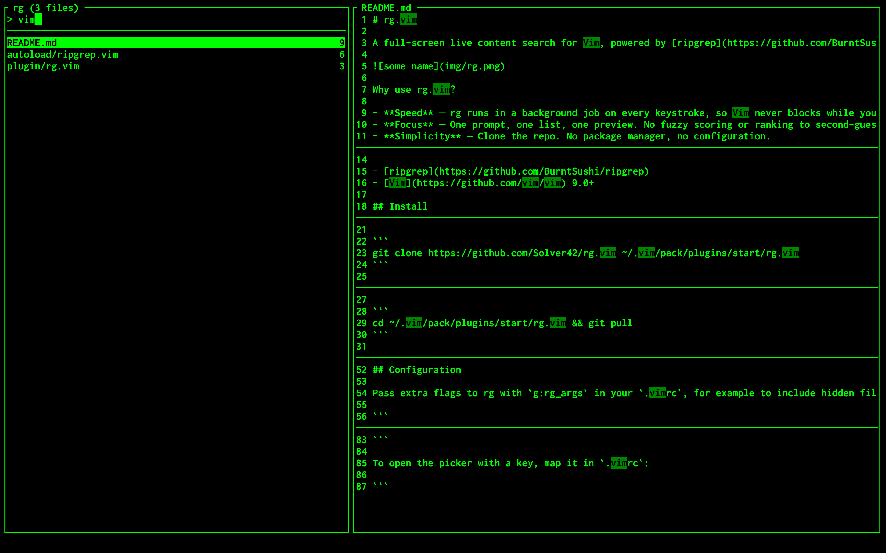

# rg.vim

A full-screen live content search for Vim, powered by [ripgrep](https://github.com/BurntSushi/ripgrep)



Why use rg.vim?

- **Speed** — rg runs in a background job on every keystroke, so Vim never blocks while you type. Vim9 script that compiles into bytecode, and the code is autoloaded: it costs nothing at startup until the first `:Rg`.
- **Focus** — One prompt, one list, one preview. No fuzzy scoring or ranking to second-guess: the query is a literal string and the results are sorted by path.
- **Simplicity** — Clone the repo. No package manager, no configuration.

## Requirements

- [ripgrep](https://github.com/BurntSushi/ripgrep)
- [Vim](https://github.com/vim/vim) 9.0+

## Install

Clone the repository:

```
git clone https://github.com/Solver42/rg.vim ~/.vim/pack/plugins/start/rg.vim
```

## Update

```
cd ~/.vim/pack/plugins/start/rg.vim && git pull
```

## Usage

- **:Rg** opens the picker in the current directory
- **:Rg {text}** opens it with an initial query
- **Type** to search, **Backspace** or **Ctrl+H** to delete
- **Ctrl+N**, **Ctrl+J** or **Down** select next file **Ctrl+P**, **Ctrl+K** or **Up** select previous file
- **Ctrl+D** or **Ctrl+F** scroll preview down **Ctrl+B** or **Ctrl+U** scroll preview up
- **Enter** open the file at its first match
- **Esc** or **Ctrl+C** close

## How it works

The left pane lists all files that contain a match, with the number of matching lines. The right pane shows the matches in the highlighted file, with the lines around each one and the matched text highlighted.

The query is a literal string, not a regular expression. It is smart-case: case-insensitive unless the query contains an uppercase letter. With an empty query every file is listed and the preview shows the top of the highlighted file.

Files are sorted by path. Like rg itself, it skips hidden files, binary files and anything ignored by `.gitignore`, `.ignore` and `.rgignore`, and your ripgrep config file is honoured. Only the first 500 files are listed, and the title shows the total.

The preview shows up to 30 matches per file, each with 2 lines of context, and long lines are cut at the edge of the pane. Binary files, files that can't be read and files over 2 MB are not read, and the preview says so instead. Paths are resolved against the directory you were in when the picker opened.

## Configuration

Pass extra flags to rg with `g:rg_args` in your `.vimrc`, for example to include hidden files but not images:

```
let g:rg_args = ['--hidden', '--glob', '!*.png']
```

You can change how many files are listed:

```
let g:rg_max_files = 1000
```

You can change how many matches are previewed per file, and how many lines of context surround each one:

```
let g:rg_max_matches = 10
let g:rg_context = 4
```

You can change how many lines the preview shows when the query is empty:

```
let g:rg_preview_lines = 100
```

You can change the size in bytes above which files are not previewed:

```
let g:rg_max_size = 1048576
```

To open the picker with a key, map it in `.vimrc`:

```
nnoremap <silent> <Leader>g :Rg<CR>
```
